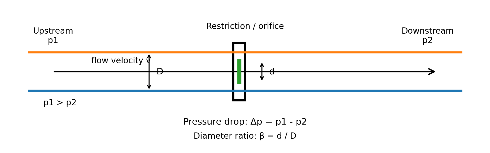

# Pressure Drop Prediction with Python and Machine Learning

This project predicts pressure drop in internal flow across a pipe/orifice-like restriction using engineering-based synthetic data and a machine learning regression model.

The goal is to connect mechanical engineering, fluid mechanics, Python automation, and machine learning in one reproducible workflow.

## Schematic


The modeled system is a pipe with a local restriction. The flow enters with velocity \(v\), passes through an orifice with diameter \(d\), and experiences a pressure drop \(\Delta p\).

```text
Upstream flow                      Restriction                    Downstream flow

p1, v  ────────────────▶     | smaller opening |     ───────────────▶  p2

Pipe diameter:      D
Orifice diameter:   d
Diameter ratio:     beta = d / D

Pressure drop:      Δp = p1 - p2
```

## Physical Background

The simplified pressure-drop relation used in this project is:

\[
\Delta p = K \cdot \frac{1}{2} \rho v^2
\]

where:

- \(\Delta p\) = pressure drop [Pa]
- \(K\) = loss coefficient [-]
- \(\rho\) = fluid density [kg/m³]
- \(v\) = flow velocity [m/s]

The loss coefficient is approximated as:

\[
K = \left(\frac{1}{\beta^4} - 1\right)
\]

where:

\[
\beta = \frac{d}{D}
\]

with:

- \(d\) = orifice diameter [m]
- \(D\) = pipe diameter [m]
- \(\beta\) = orifice-to-pipe diameter ratio [-]

The Reynolds number is calculated as:

\[
Re = \frac{\rho v D}{\mu}
\]

where:

- \(Re\) = Reynolds number [-]
- \(\mu\) = dynamic viscosity [Pa·s]

## Problem

Given flow and geometry parameters, the objective is to predict the pressure drop across a pipe/orifice-like restriction.

## Inputs

The machine learning model uses the following input features:

- Fluid density
- Dynamic viscosity
- Pipe diameter
- Flow velocity
- Orifice diameter ratio
- Reynolds number

## Output

The target variable is:

- Pressure drop [Pa]

## Dataset

The dataset is synthetically generated using engineering equations.

Each row represents one operating condition with randomly sampled fluid and geometry parameters.

The target value, pressure drop, is calculated from the simplified physical equation:

\[
\Delta p = K \cdot \frac{1}{2} \rho v^2
\]

This makes the dataset useful for building a first reproducible workflow before moving to CFD-generated or experimental data.

## Machine Learning Model

A Random Forest regression model is trained to predict pressure drop from the generated input features.

The model learns the relationship between:

- velocity
- restriction ratio
- density
- Reynolds number
- pipe diameter
- viscosity

and the resulting pressure drop.

## Results

The baseline model achieved the following performance:

| Metric | Value |
|---|---:|
| MAE | 3670.92 Pa |
| RMSE | 10267.12 Pa |
| R² | 0.9971 |

## Metric Interpretation

### MAE

MAE stands for Mean Absolute Error.

It describes the average absolute prediction error.

In this project:

\[
MAE = 3670.92 \, Pa
\]

This means that, on average, the model prediction differs from the formula-based pressure-drop value by about 3671 Pa.

### RMSE

RMSE stands for Root Mean Squared Error.

It also measures prediction error, but it penalizes large errors more strongly than MAE.

In this project:

\[
RMSE = 10267.12 \, Pa
\]

The RMSE is larger than the MAE, which means that some high-pressure-drop cases have larger prediction errors.

### R²

R² measures how much of the target variation is explained by the model.

In this project:

\[
R^2 = 0.9971
\]

This means that the model explains about 99.71% of the pressure-drop variation.

## Engineering Interpretation

The model learned the pressure-drop behavior very well.

The most important features are:

1. Beta
2. Velocity

This is physically reasonable because pressure drop depends strongly on the dynamic pressure term:

\[
v^2
\]

and on the restriction term:

\[
\frac{1}{\beta^4}
\]

A smaller beta value means a smaller orifice opening relative to the pipe diameter. This creates a stronger restriction and therefore a much higher pressure drop.

Velocity is also important because pressure drop increases approximately with the square of velocity.

Density contributes directly through the dynamic pressure term.

Viscosity and pipe diameter mainly affect the Reynolds number in this simplified setup, but they do not directly appear in the pressure-drop equation used to generate the target value.

## Workflow

1. Generate engineering-based synthetic data.
2. Explore and visualize the dataset.
3. Train a regression model.
4. Compare ML predictions against formula-based values.
5. Visualize prediction errors.
6. Interpret the results from an engineering perspective.

## How to Run

Create and activate a virtual environment:

```bash
python3 -m venv .venv
source .venv/bin/activate
```

Install dependencies:

```bash
pip install -r requirements.txt
```

Generate the dataset:

```bash
python src/generate_data.py
```

Train the model:

```bash
python src/train_model.py
```

Generate evaluation plots:

```bash
python src/plot_results.py
```

## Project Structure

```text
pressure-drop-ml/
│
├── assets/
│   └── pressure_drop_schematic.png
│
├── data/
│   └── generated/
│
├── figures/
│   └── generated/
│
├── notebooks/
│   └── 01_data_exploration.ipynb
│
├── reports/
│   └── model_interpretation.md
│
├── src/
│   ├── __init__.py
│   ├── generate_data.py
│   ├── train_model.py
│   └── plot_results.py
│
├── tests/
├── requirements.txt
├── README.md
└── .gitignore
```

## Generated Plots

The project generates the following plots:

- Actual vs predicted pressure drop
- Residuals vs predicted pressure drop
- Feature importance
- Velocity vs pressure drop

These plots help evaluate both the machine learning performance and the physical behavior of the generated dataset.

## Limitations

This project uses simplified synthetic data. It does not yet include:

- CFD simulation results
- experimental measurements
- turbulence model effects
- wall roughness
- compressibility
- discharge coefficient corrections
- complex geometry effects
- measurement noise
- uncertainty quantification

The current model is therefore not intended as a production-ready pressure-drop predictor. It is a reproducible first step for connecting fluid mechanics, Python, and machine learning.

## Next Steps

Possible extensions:

- Generate CFD data with OpenFOAM.
- Compare ML predictions against CFD results.
- Add noise to simulate measurement uncertainty.
- Add discharge coefficient corrections.
- Train additional models such as Linear Regression, Gradient Boosting, or Neural Networks.
- Add model comparison.
- Add unit tests.
- Add GitHub Actions for continuous integration.
- Add a small interactive dashboard.
